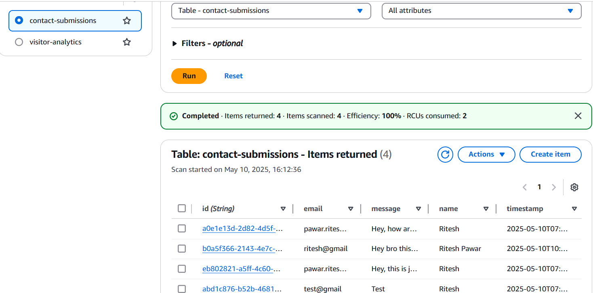

# Learnbay_project
Employee portfolio hosting &amp; analytics platform using AWS and DevOps

📄 Project Summary: AWS Static Website with Contact Form and Analytics

Project Objective:

Develop a responsive static portfolio website hosted on AWS, featuring a contact form and visitor analytics, utilizing serverless AWS services for scalability and cost-effectiveness.

🧱 Architecture Overview

Frontend:

1.Amazon S3: Hosts the static website files (HTML, CSS, JavaScript).

Backend:

1.Amazon API Gateway: Exposes RESTful endpoints (/submit, /analytics) to handle form submissions and analytics data.

AWS Lambda:

1.contactFormHandler: Processes contact form submissions and stores data in DynamoDB.

2.analyticsHandler: Captures visitor analytics and logs data to DynamoDB.

Amazon DynamoDB:

1.contact-submissions: Stores user-submitted contact form data.

2.visitor-analytics: Logs visitor analytics data.

Deployment & Automation:

1.GitHub Actions: It automates the build and deployment process, including:

2.Replacing API endpoint placeholders in JavaScript files.

3.Uploading updated files to the S3 bucket.

🔄 Data Flow

User Interaction:

1.A visitor accesses the static website hosted on Amazon S3.

2.The visitor fills out the contact form and submits it.

Form Submission:

1.JavaScript (contacts.js) captures the form data and sends a POST request to the /submit endpoint via API Gateway.

Backend Processing:

1.API Gateway forwards the request to the contactFormHandler Lambda function.

2.The Lambda function processes the data and stores it in the contact-submissions DynamoDB table.

Analytics Logging:

1.Simultaneously or on page load, analytics.js sends visitor data to the /analytics endpoint.

2.API Gateway routes this to the analyticsHandler Lambda function.

3.The function logs the data into the visitor-analytics DynamoDB table.

📁 CloudWatch Log Groups Created

For each Lambda function:

/aws/lambda/contact_form_handler

/aws/lambda/visitor_logger

📁 CloudWatch Alarms configured

Lambda Error Rate Alarm: If errors > 1 in 5 minutes

Below are some screenshots from the project.

